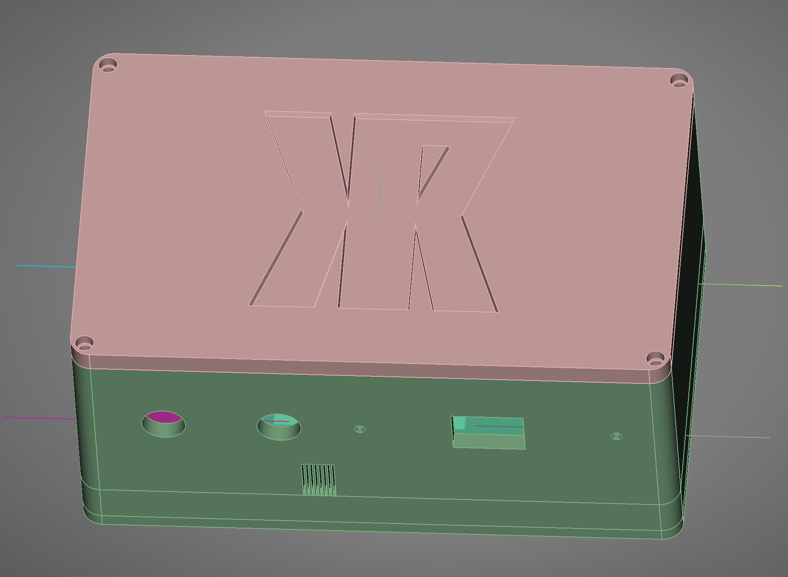
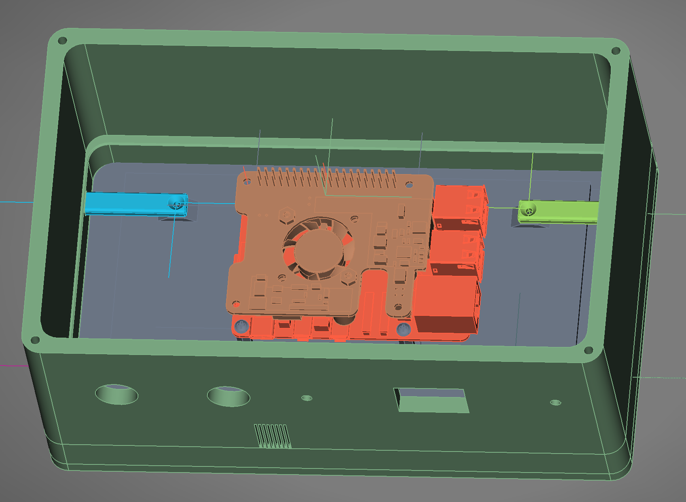
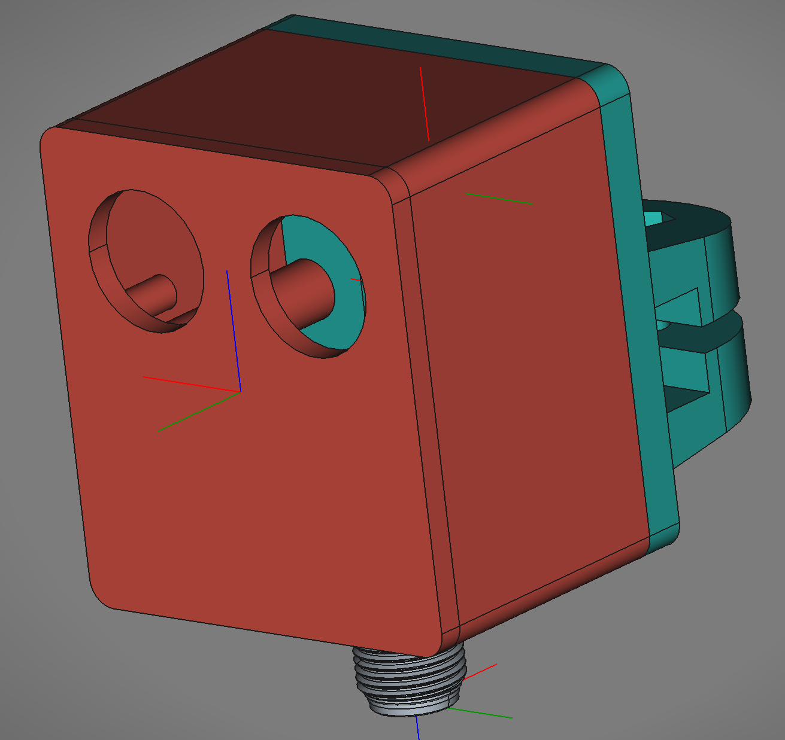
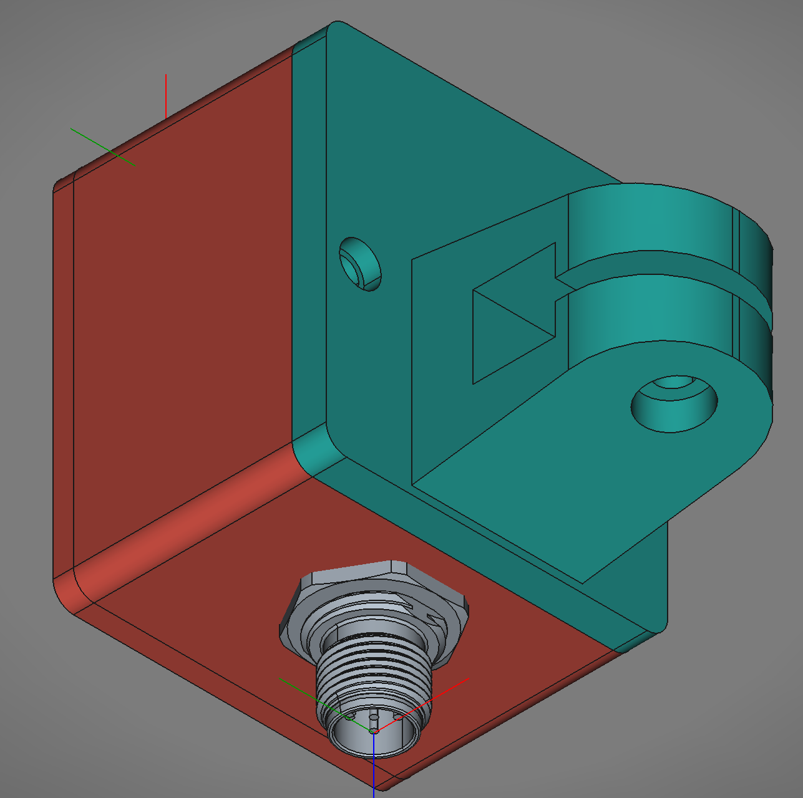
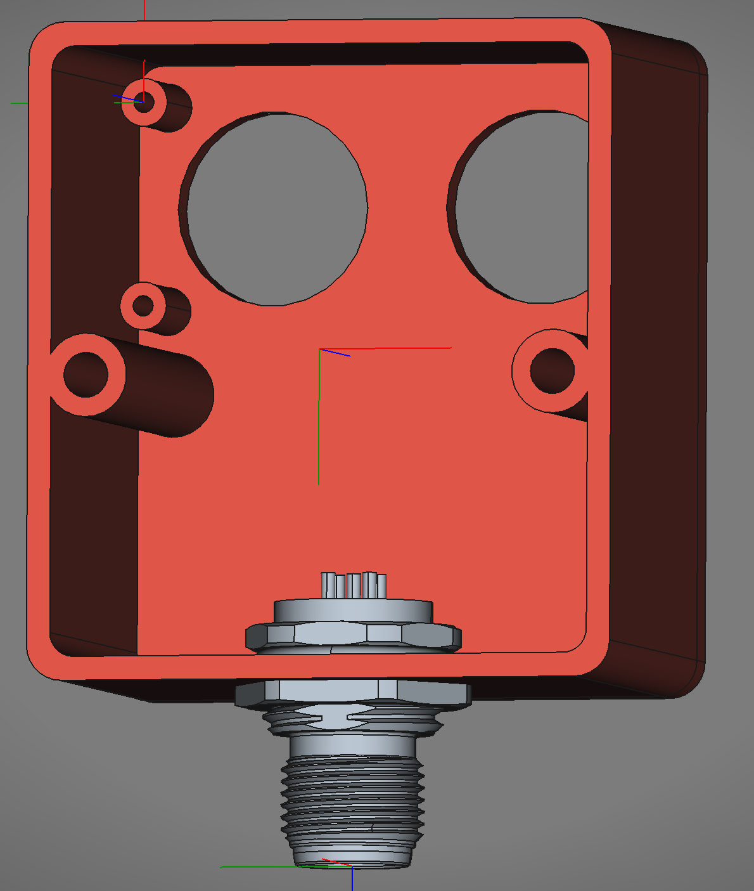

# pi-networked-counter
Network attached counter using Pi5, python, pyqt6, and sqlite







## Dev Setup (Linux)

- clone repository:
```
git clone https://github.com/rassweiler/pi-networked-counter.git && cd pi-networked-counter
```

- Setup python environment:
```
python3 -m venv venv

source venv/bin/activate

pip3 install [lgpio] pyqt6 gpiozero
```

## Device Setup (Pi5+)

### Part List
- 1 [Rasperry Pi 5+](https://www.canakit.com/raspberry-pi-5-8gb.html?cid=CAD&src=raspberrypi)
- 1 [Rasperry Pi 5+ Power Supply](https://www.canakit.com/official-raspberry-pi-5-power-supply-27w-usb-c.html?defpid=4863)
- 1 [Micor SSD](https://www.amazon.ca/Samsung-Memory-Adapter-Limited-Warranty/dp/B09FFD6R2B/)
- 1 [Raspberry Pi 7" screen](https://www.canakit.com/raspberry-pi-lcd-display-touchscreen.html)
- 1 [Pi5 Diplay adapter cable](https://www.canakit.com/raspberry-pi-5-display-cable.html)
- 1 [Pi5 POE Hat](https://www.pishop.ca/product/power-over-ethernet-hat-f-for-raspberry-pi-5-cooling-fan-802-3af-at/)
- 2 [Harting Cables](https://www.digikey.ca/en/products/detail/harting/21348485484050/7917624)
- 2 [M12 AMP Connector Male](https://www.digikey.ca/en/products/detail/te-connectivity-amp-connectors/T4171010005-001/7927449)
- 2 [M12 AMP Connector Female](https://www.digikey.ca/en/products/detail/te-connectivity-amp-connectors/T4171310004-001/7221375)
- 1 [Pack of jumper pin connectors](https://www.amazon.ca/Elegoo-120pcs-Multicolored-Breadboard-arduino/dp/B01EV70C78/)
- 1 [Roll of PETG filament](https://store.makerwiz.com/collections/3d-filaments/products/prusa-research-prusament-petg-anthracite-grey-1kg)
- 2 [Ultrasonic Distance Sensor 3.3v](https://www.pishop.ca/product/us-100-ultrasonic-sensor-with-temperature-compensation-range/)
- 1 [Ethernet Keystone Inline](https://www.amazon.ca/5PACK-CAT6-Keystone-Inline-Coupler-White/dp/B0116T7XMQ/)
- 1 [Ethernet Patch Cable](https://www.amazon.ca/Cable-Matters-5-Pack-Snagless-Ethernet/dp/B00C4U030G)
- 1 [USB C Keystone Jack Cable](https://www.amazon.ca/Poyiccot-Keystone-Cable-White-Black/dp/B08BJJZV2Z)
- 1 [USB A Keystone Jack Cable](https://www.amazon.ca/Keystone-Haokiang-Adapters-Connector-Cable-20CM/dp/B07JFRLLQF)

### Software

- clone repository:
```
git clone https://github.com/rassweiler/pi-networked-counter.git && cd pi-networked-counter
```

- Setup python environment:
```
python3 -m venv venv

source venv/bin/activate

pip3 install [lgpio] pyqt6 gpiozero
```

- Copy the desktop file to the autostart configs:
```
cp object-counter.Desktop ~/.config/autostart/
```

### Print Parts

- Print out the [front case](./Models/Exports/NetworkCounter_Case_Front_Print.3mf) section
- Print out the [rear case](./Models/Exports/NetworkCounter_Case_Back_Print.3mf) section
- Print out 2 [front sensor case](./Models/Exports/NetworkCounter_SensorCase_Front_Print.3mf) sections
- Print out 2 [rear sensor case](./Models/Exports/NetworkCounter_SensorCase_Back_Print.3mf) sections
- Print any required brackets/stands

### Prepare Sensors

- Solder a jumper wire across both GND pins
- Remove the jumper from the rear of the unit to use PWM mode
- Solder the M12 AMP Connector Male to the sensor following the pinout below

### Sensor Pinout To Cable

- Pin 1 (Brown): 3.3V 
- Pin 2 (White): Trig 
- Pin 3 (Blue): Echo 
- Pin 4 (Black): Ground 
- Pin 5 (Gray): Unused

### Pi5 Wiring

- Pin 1 (3.3V): To infeed sensor pin 1
- Pin 2 (5V): To Display pin 5 (5V)
- Pin 6 (GND): To Display pin 1 (GND)
- Pin 9 (GND): To infeed sensor pin 4
- Pin 11: To infeed sensor pin 2
- Pin 13: To infeed sensor pin 3
- Pin 14 (GND): To outfeed sensor pin 4
- Pin 16: To outfeed sensor pin 2
- Pin 17   (3.3V): To outfeed sensor pin 1
- Pin 18: To outfeed sensor pin 3