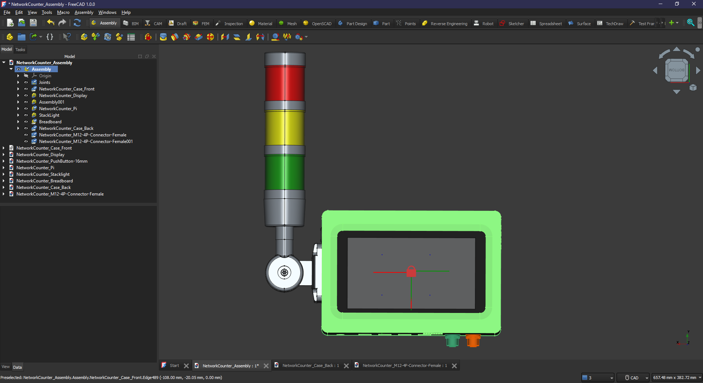
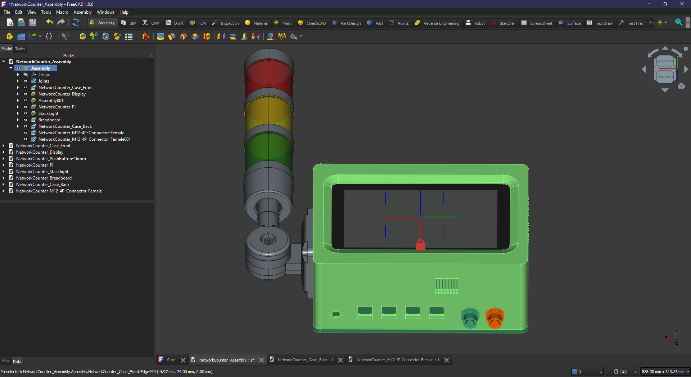
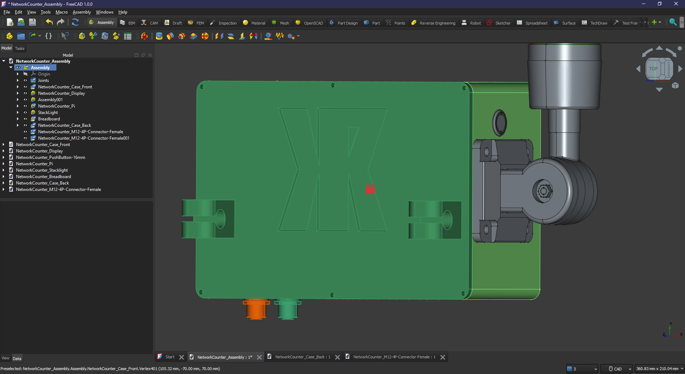
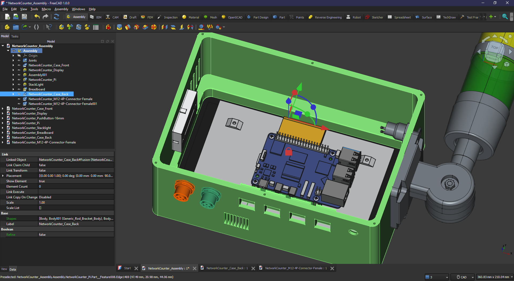
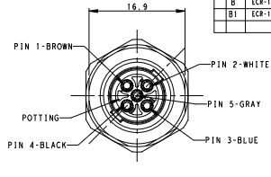
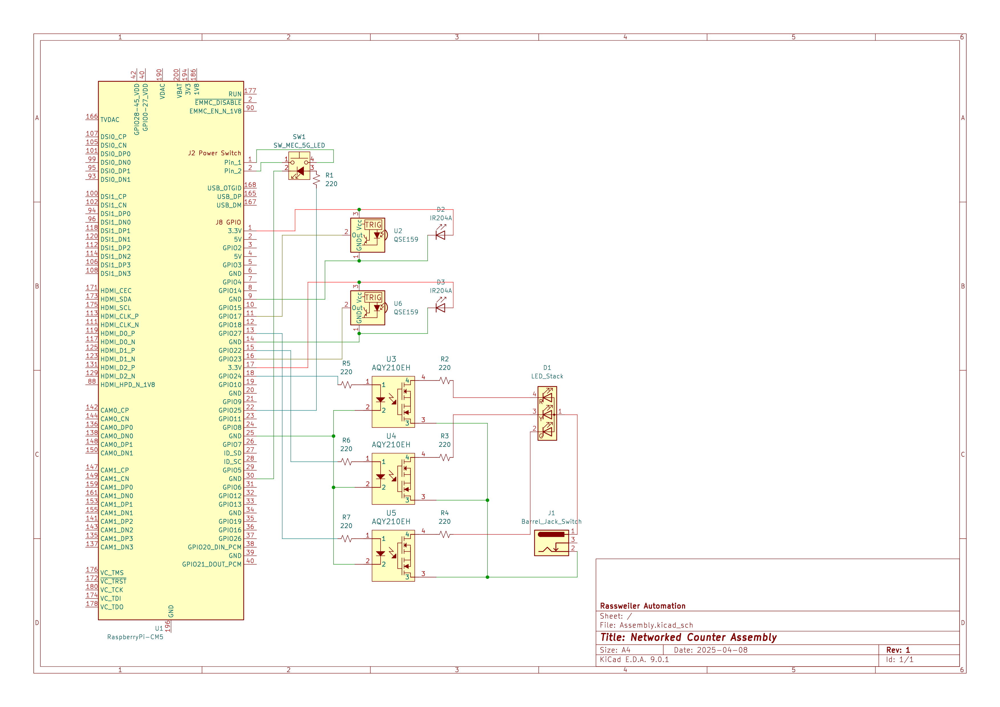

# pi-networked-counter
Network attached counter using Pi5, python, pyqt6, and sqlite







## Dev Setup (Linux)

- clone repository:
```
git clone https://github.com/rassweiler/pi-networked-counter.git && cd pi-networked-counter
```

- Setup python environment:
```
python3 -m venv venv

source venv/bin/activate

pip3 install gpiozero lgpio msal msal_extensions python-dotenv pygobject
```

- Install optional packages:
```
sudo apt install qtcreator sqlitebrowser
```

## Device Setup (Pi5+)

### Base Version Part List
- 1 [Raspberry Pi 5+](https://www.canakit.com/raspberry-pi-5-8gb.html?cid=CAD&src=raspberrypi)
- 1 [Raspberry Pi 5+ Power Supply](https://www.canakit.com/official-raspberry-pi-5-power-supply-27w-usb-c.html?defpid=4863)
- 1 [Micro SSD](https://www.amazon.ca/Samsung-Memory-Adapter-Limited-Warranty/dp/B09FFD6R2B/)
- 1 [Raspberry Pi 7" screen](https://www.canakit.com/raspberry-pi-lcd-display-touchscreen.html)
- 1 [Pi5 Diplay adapter cable](https://www.canakit.com/raspberry-pi-5-display-cable.html)
- 2 [Harting Cables](https://www.digikey.ca/en/products/detail/harting/21350102507010/16669171)
- 2 [M12 AMP Connector Male](https://www.digikey.ca/en/products/detail/te-connectivity-amp-connectors/T4171010005-001/7927449)
- 2 [M12 AMP Connector Female](https://www.digikey.ca/en/products/detail/te-connectivity-amp-connectors/T4171110005-001/7221411)
- 1 [Pack of jumper pin connectors](https://www.amazon.ca/Elegoo-120pcs-Multicolored-Breadboard-arduino/dp/B01EV70C78/)
- 1 [Roll of PETG filament](https://www.prusa3d.com/product/prusament-petg-anthracite-grey-1kg/)
- 2 [IR Emitter/ Receiver 5mm 3.3v](https://www.adafruit.com/product/2168#technical-details)
- 1 [Ethernet Keystone Inline](https://www.amazon.ca/5PACK-CAT6-Keystone-Inline-Coupler-White/dp/B0116T7XMQ/)
- 1 [Ethernet Patch Cable](https://www.amazon.ca/Cat-Ethernet-Cable-0-5ft-Pack/dp/B0CMQG7GS1)
- 1 [USB C Keystone Jack Adapter USB 3.1](https://www.amazon.ca/AAOTOKK-Keystone-Adapter-Type-C-Coupler/dp/B07Z947FRN)
- 1 [USB C patch cable](https://www.amazon.ca/Silkland-Charging-Compatible-MacBook-Samsung/dp/B0CQ4SX256)
- 1 [USB A Keystone Jack Cable](https://www.amazon.ca/Keystone-Haokiang-Adapters-Connector-Cable-20CM/dp/B07JFRLLQF)
- 1 [22awg Wire 2 Conductor 25ft](https://www.digikey.ca/en/products/detail/prysmian/C6348A-46-10/2761061)
- 1 [Rugged Metal Pushbutton - 16mm White Momentary](https://www.adafruit.com/product/558)
- 2 [Wire Connector Pack](https://www.amazon.ca/Connector-Solderless-Connectors-Stripping-Electrical/dp/B08929GXGK)
- 1 [GPIO Ribbon Cable](https://www.adafruit.com/product/1988)
- 1 [GPIO Header](https://www.pishop.ca/product/40-pin-gpio-connector-header/)

### Stacklight Version Part List
- 1 [DC Power Panel Jack](https://www.amazon.ca/DIYhz-Socket-Female-Mounting-Connector/dp/B079D6P26P)
- 1 [DC Power Supply](https://www.amazon.ca/ALITOVE-Adapter-Converter-100-240V-5-5x2-1mm/dp/B01GEA8PQA)
- 1 [Through-Hole Resistors - 1K ohm 5% 1/4W](https://www.adafruit.com/product/4294)
- 1 [Through-Hole Resistors - 220 ohm 5% 1/4W](https://www.adafruit.com/product/2780)
- 1 [AQY210EH SSR](https://www.digikey.ca/en/products/detail/panasonic-electric-works/AQY210EH/513082)
- 1 [Tower Light - Red Yellow Green Alert Light](https://www.adafruit.com/product/2993#technical-details)
- 1 [Tiny Premium Breadboard](https://www.adafruit.com/product/65#description)

### Optional Parts
- 1 [Pi5 POE Hat](https://www.pishop.ca/product/power-over-ethernet-hat-f-for-raspberry-pi-5-cooling-fan-802-3af-at/)

### Pi Software

- Update system
```
sudo apt update && sudo apt upgrade
```

- Install packages
```
sudo apt install < .packages
```

- Disable sudo NOPASSWD:
```
sudo nano /etc/sudoers.d/010_pi-nopasswd

remove NOPASSWD:
```

- Enable sudo logging:
```
sudo visudo

Insert:

Defaults    logfile=/var/log/sudo
```

- Harden ssh config:
```
sudo nano /etc/ssh/sshd_config

PermitRootLogin prohibit-password
MaxAuthTries 5
MaxSessions 3
MaxStartups 3:90:15
PasswordAuthentication no
```

- Harden ssh keys:
```
echo -e "# Restrict key exchange, cipher, and MAC algorithms, as per sshaudit.com\n# hardening guide.\n KexAlgorithms sntrup761x25519-sha512,sntrup761x25519-sha512@openssh.com,curve25519-sha256,curve25519-sha256@libssh.org,gss-curve25519-sha256-,diffie-hellman-group16-sha512,gss-group16-sha512-,diffie-hellman-group18-sha512,diffie-hellman-group-exchange-sha256\n\nCiphers chacha20-poly1305@openssh.com,aes256-gcm@openssh.com,aes256-ctr,aes192-ctr,aes128-gcm@openssh.com,aes128-ctr\n\nMACs hmac-sha2-256-etm@openssh.com,hmac-sha2-512-etm@openssh.com,umac-128-etm@openssh.com\n\nHostKeyAlgorithms sk-ssh-ed25519-cert-v01@openssh.com,ssh-ed25519-cert-v01@openssh.com,rsa-sha2-512-cert-v01@openssh.com,rsa-sha2-256-cert-v01@openssh.com,sk-ssh-ed25519@openssh.com,ssh-ed25519,rsa-sha2-512,rsa-sha2-256\n\nRequiredRSASize 3072\n\nCASignatureAlgorithms sk-ssh-ed25519@openssh.com,ssh-ed25519,rsa-sha2-512,rsa-sha2-256\n\nGSSAPIKexAlgorithms gss-curve25519-sha256-,gss-group16-sha512-\n\nHostbasedAcceptedAlgorithms sk-ssh-ed25519-cert-v01@openssh.com,ssh-ed25519-cert-v01@openssh.com,sk-ssh-ed25519@openssh.com,ssh-ed25519,rsa-sha2-512-cert-v01@openssh.com,rsa-sha2-512,rsa-sha2-256-cert-v01@openssh.com,rsa-sha2-256\n\nPubkeyAcceptedAlgorithms sk-ssh-ed25519-cert-v01@openssh.com,ssh-ed25519-cert-v01@openssh.com,sk-ssh-ed25519@openssh.com,ssh-ed25519,rsa-sha2-512-cert-v01@openssh.com,rsa-sha2-512,rsa-sha2-256-cert-v01@openssh.com,rsa-sha2-256\n\n" > /etc/ssh/sshd_config.d/ssh-audit_hardening.conf
```

- Remove avahi:
```
sudo systemctl stop avahi-daemon && sudo systemctl disable avahi-daemon

sudo apt purge avahi-daemon -y
```

- Remove CUPS:
```
sudo systemctl stop cups && sudo systemctl disable cups

sudo apt purge cups -y 
```

- PI configure
Set the locale to UTF-8

- Setup keyring for sharepoint integration
Run seahorse and make sure there is a default keystore

- clone repository to PI:
```
git clone https://github.com/rassweiler/pi-networked-counter.git && cd pi-networked-counter
```

- Copy the desktop file to autostart the app:
```
sudo cp objectcounter.desktop /etc/xdg/autostart/objectcounter.desktop
```

- Add panel icon
```
cp objectcounter.desktop ~/.local/share/applications/
```

Then restart the system to get the app in the menu under other, then right click the app and select add to taskbar

- Setup startup IO for push button
```
echo "dtoverlay=gpio-poweroff,gpiopin=25,active_low" >> /boot/firmware/config.txt
```

### Sharepoint Setup (Optional)

- Add to the `.settup.toml` file your sharepoint access details:
```
[sharepoint]
authority = "https://login.microsoftonline.com/{AID}"
client = "{CID}"
scopes = 'User.ReadBasic.All Files.ReadWrite Sites.ReadWrite.All'
endpoint = "https://graph.microsoft.com/v1.0/me" 
```

- run the `get_token.sh` script once to initialise your sharepoint token, it should provide a link and a key to login using a browser.

### Print Parts

- Print out the [Front case](./Models/Exports/NetworkCounter_Case_Front_Print.3mf) section (Should contain the screen brackets as well)
- Print out the [Rear case](./Models/Exports/NetworkCounter_Case_Back_Print.3mf) section
- Print out the [Sensor case](./Models/Exports/NetworkCounter_SensorCase_Front_Print.3mf) sections
- Print any required brackets/stands

### Prepare Sensors

- Connect both power wires together from the IR emitter and receiver
- Connect both ground wires together from the IR emitter and receiver
- Solder the M12 AMP Connector Male to the sensors following the pinout below

### Sensor Pinout To Cable

- Pin 1 (Brown): 3.3V 
- Pin 2 (White): Unused 
- Pin 3 (Blue): Emitter signal (Yellow) 
- Pin 4 (Black): Ground 
- Pin 5 (Gray): Unused


### Lightstack Pinout

- Cable Brown: 12V 
- Cable Green: Green LED 
- Cable Yellow: Yellow LED 
- Cable Red: Red LED 

### Pi5 Wiring 

- Pin 1 (3.3V): To infeed sensor pin 1
- Pin 2 (5V): To Display pin 5 (5V)
- Pin 6 (GND): To Display pin 1 (GND)
- Pin 9 (GND): To infeed sensor pin 4
- Pin 11: To infeed sensor pin 3
- Pin 13: To stack light green wire
- Pin 14 (GND): To outfeed sensor pin 4
- Pin 15: To stack light yellow wire
- Pin 16: To outfeed sensor pin 3
- Pin 17: (3.3V): To outfeed sensor pin 1
- Pin 18: To stack light red wire
- Pin 22: To power led +
- Pin 25 (GND): To dev board for ground
- Pin 30 (GND): To power led -

### Assembly Schematic
The Pi5 board is not entirely accurate, the J2 and J8 pins are proper however.
